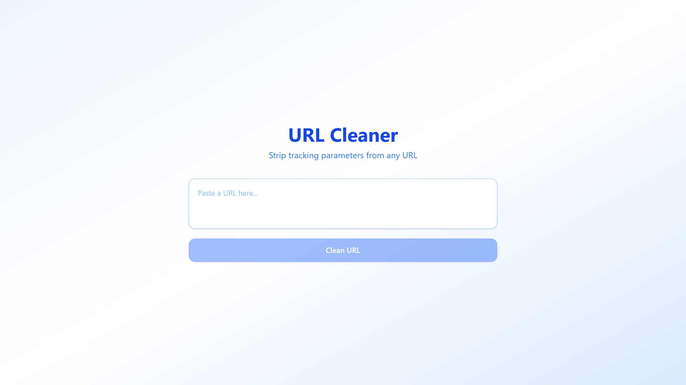

# URL Cleaner

[](https://github.com/kamarajendra/url-cleaner/actions/workflows/ci.yml)
[](https://github.com/kamarajendra/url-cleaner/releases)
[](https://github.com/kamarajendra/url-cleaner/blob/main/LICENSE)

Paste a messy URL and strip tracking parameters (UTM, Facebook, Google, etc.) for clean, shareable links. No server, no API, no uploads.

## Screenshot



## Features

- Paste any URL and remove tracking clutter
- One-click copy of the cleaned URL
- Strips utm_source, utm_medium, utm_campaign, utm_term, utm_content, fbclid, gclid, ref, source, mc_cid, mc_eid
- Input history with localStorage

## Tech Stack

- Next.js 16 App Router
- React 19
- TypeScript
- Tailwind CSS 4
- Vitest

## Getting Started

```bash
npm install
npm run dev
```

## License

MIT
